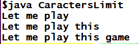

# Java problem solution

**Repository that will contain several java code file**

- Each file gives a solution for one problem.
- Each time you modify the .java file you should run the two commands below:

```

# To compile a java file run this
javac filename.java

# To run the main class, execute this
java filename
```
- Caracters limit : 



*All the files are tested in jdk 8 environement*
